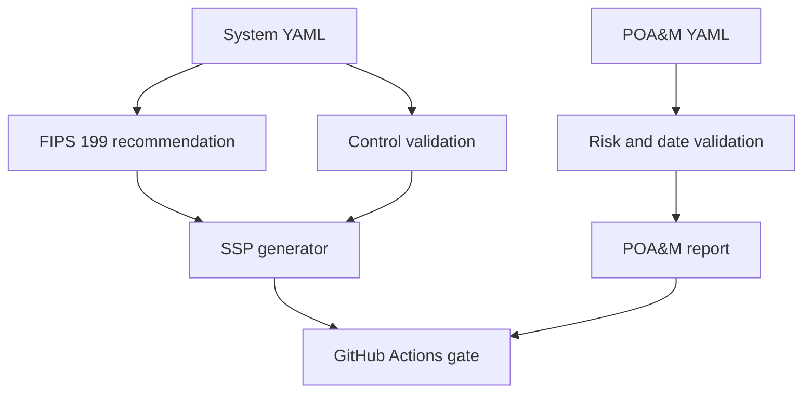

# OpenRMF Forge

[](https://github.com/rparr23/rmf-compliance-as-code/actions/workflows/validate.yml)

Open-source NIST RMF compliance-as-code toolkit that turns structured system metadata into a draft security categorization, System Security Plan (SSP), Plan of Action and Milestones (POA&M) report, and machine-readable validation results.

## Why this project

Security authorization information is often divided across documents, spreadsheets, tickets, and scanning tools. OpenRMF Forge demonstrates a traceable workflow in which system facts, control implementations, evidence references, findings, and remediation dates are version-controlled and tested like code.

It supports the seven-step NIST RMF lifecycle: Prepare, Categorize, Select, Implement, Assess, Authorize, and Monitor. The current MVP focuses on decision support for Categorize, Implement, and Monitor.

## Features

- FIPS 199 high-water-mark categorization recommendation
- Human-approval flag for consequential decisions
- SSP generation from YAML and Jinja templates
- POA&M validation, risk summary, and overdue detection
- NIST control-ID and implementation-statement linting
- Placeholder and incomplete-document detection
- Closure-evidence requirement for POA&M items
- GitHub Actions compliance gate
- Fictional enterprise AI document-assistant demonstration
- Version metadata for SP 800-53 Release 5.2.0 and OSCAL 1.2.3

## Quick start

```bash
python -m venv .venv
source .venv/bin/activate
pip install -e '.[dev]'

openrmf categorize examples/ai-document-assistant/system.yaml
openrmf validate examples/ai-document-assistant/system.yaml --poam examples/ai-document-assistant/poam.yaml
openrmf build examples/ai-document-assistant/system.yaml --poam examples/ai-document-assistant/poam.yaml
```

Generated artifacts appear in `build/`:

- `system-security-plan.md`
- `poam-report.md`
- `validation-results.json`

## Example business scenario

Northstar Workforce Solutions operates a fictional internal retrieval-augmented AI assistant. The sample models an Azure authorization boundary, workforce identity, employee information, control allocation, monitoring, and remediation work. All records and evidence references are synthetic.

## Architecture



## Accuracy and scope

The tool provides decision support, draft artifacts, and consistency checks. It does not determine compliance, assess control effectiveness, grant an authorization to operate, or replace an ISSO, assessor, privacy official, system owner, or authorizing official. Baseline selection and tailoring require organizational context and documented human approval.

Authoritative references:

- [NIST Risk Management Framework](https://csrc.nist.gov/projects/risk-management)
- [FIPS 199](https://csrc.nist.gov/pubs/fips/199/final)
- [NIST SP 800-37 Rev. 2](https://csrc.nist.gov/pubs/sp/800/37/r2/final)
- [NIST SP 800-53 Rev. 5, Release 5.2.0](https://csrc.nist.gov/pubs/sp/800/53/r5/upd1/final)
- [NIST SP 800-53B](https://csrc.nist.gov/pubs/sp/800/53/b/upd1/final)
- [NIST OSCAL](https://pages.nist.gov/OSCAL/)

## Roadmap

- Import official OSCAL catalog and baseline profiles
- Generate and validate OSCAL Profile, Component Definition, and SSP models
- Add control inheritance and shared-responsibility matrices
- Add evidence manifests, freshness checks, and cryptographic hashes
- Import SARIF, SBOM, Terraform, and sanitized cloud-inventory results
- Add NIST AI RMF and CSF 2.0 crosswalks as clearly labeled, project-authored mappings
- Export ticket payloads for ServiceNow and Jira workflows

## License

Apache-2.0

